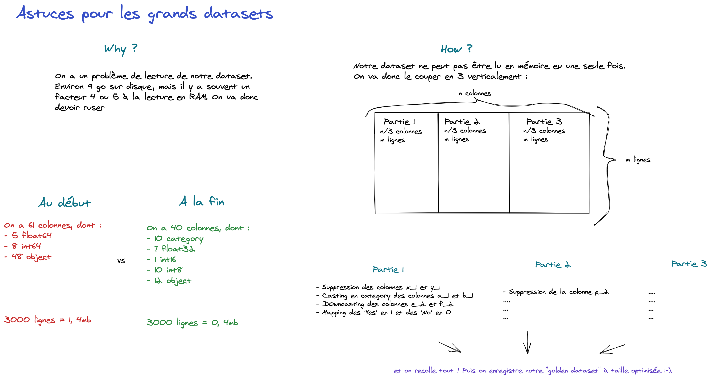

# Tips and tricks large datasets

### What is it ?

Some tips and tricks that you can use when you struggle using large datasets. Especially as you work on Dataiku, you do not have a clear visibility on what you can use or not.  

Sorry, notebooks and schema are in French ;-).
Here is the schema to illustrate what we do in these notebooks.

### notebooks
* **1_Optimize_memory_usage_anonymized.ipynb**: Tips to show infos about your machine, and how we optimize memory usage for a specific dataset using what we describe in the schema.
* **2_Read_optimized_dataset_anonymized.ipynb**: Read our previously optimized dataset.